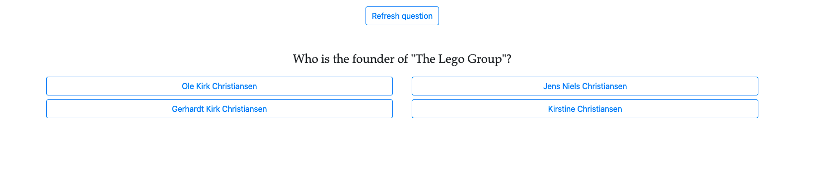

# Random trivia website
This website acts as a front-end for API requests made from `https://opentdb.com/`. API calls are made and the received JSON is rendered to the front-end. 

## Frameworks used:
- Javascript
- Bootstrap
- HTML

## To-Do: 
- Update the GET request to use `axios` instead of `fetch`
- Make it so the user can choose categories of what questions they want to answer
- Make the front end look prettier 
- Scoring system?

# Link to the website
`https://random-trivia-app.herokuapp.com/`